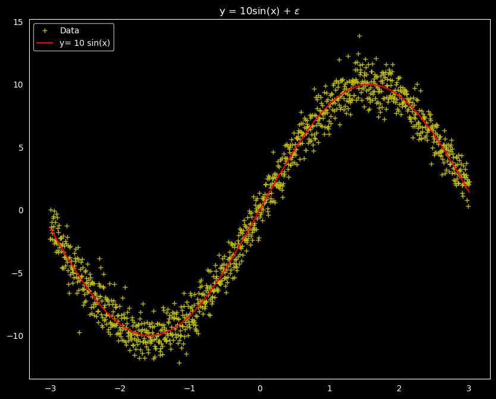

## About
The repository consists of information assosicated with the research on uncertainity quantification for graph neural network architectures. This work was part of an internship at [ANL](https://www.anl.gov/mcs) in the Mathematics and Computer Sciences (MCS) division. The repository has 5 directories:
- `literature/` - Summaries of all the scholarly articles that are read through the course of the project.
- `src/` - Code, documentation, and essential information about the models built for the project.
- `scripts/` - Essential scripts necessary for setting up the project.
- `tests/` - Deterministic unit tests for better replication of the results.
- `notebooks/` - Jupyter notebook(s) with sample code showcasing how to utilize the resources of the project.

## Installation

Install the appropriate python packages
```shell
pip install -r requirements.txt
```

## Experiments
We generated a `sin` dataset of sample size 1201 with gaussian noise given by, `y = 10 sin(x) + ε`. We built simple deep neural networks for predicting the response variable. We then estimated the uncertainties in the models predicting the response values. We tried different approaches and as a result some of the methods that we used supported quantification of both aleatoric, and epistemic uncertainties, while the remaining weren't equipped for the same.

The dataset we used looks like this: 



The approaches we have tried could potentially be categorized into ones that are capable of estimating both aleatoric, and epistemic uncertainties, and others that can only estimate epistemic uncertainties.

*Methods that can approximate both aleatoric and epistemic uncertainty :*
- **Bayesian Neural Network** : [Bayesian Learning for Neural Networks by R.M. Neal](http://citeseerx.ist.psu.edu/viewdoc/download?doi=10.1.1.446.9306&rep=rep1&type=pdf)
- **SQR+ONC** : [Single-Model Uncertainties for Deep Learning by N.Tagasovska, and D. Lopez-Paz](https://arxiv.org/pdf/1811.00908.pdf)
<hr>

*Methods that can approximate only epistemic uncertainty :*
- **DeepEnsembles** : [Simple and Scalable Predictive Uncertainty Estimation using Deep Ensembles by B. Lakshminarayanan et.al](https://arxiv.org/pdf/1612.01474.pdf)
- **MC Dropout** : [Dropout as a Bayesian Approximation: Representing Model Uncertainty in Deep Learning by Y. Gal, and Z. Ghahramani](https://arxiv.org/pdf/1506.02142.pdf)
- **Ensemble MC Dropout** : [Understanding Measures of Uncertainty for Adversarial Example Detection by L. Smith, and Y. Gal](https://arxiv.org/pdf/1803.08533.pdf)


## Author
[Akhil Pandey](https://github.com/akhilpandey95)

## Mentor
[Prasanna Balaprakash](https://github.com/pbalapra)

