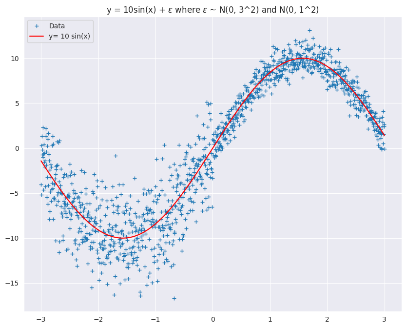
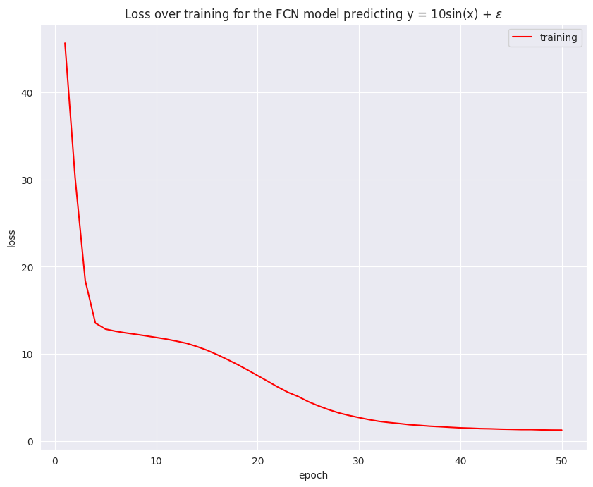
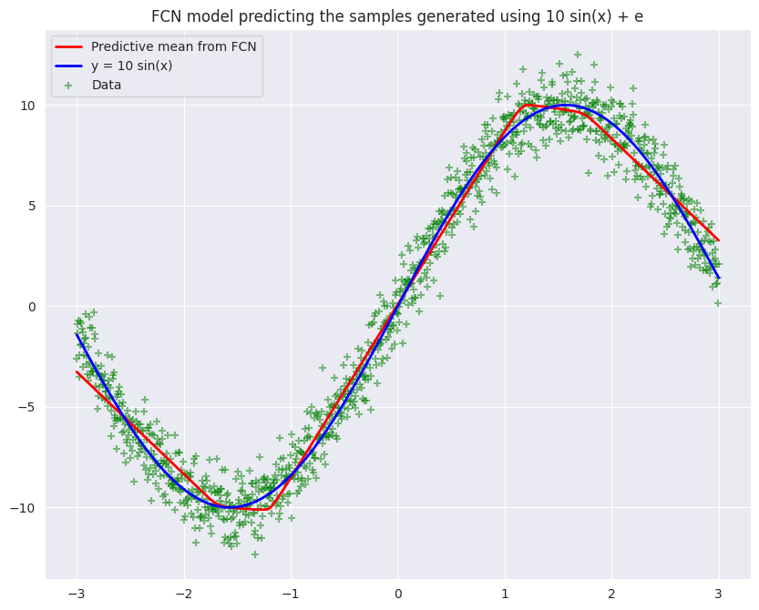
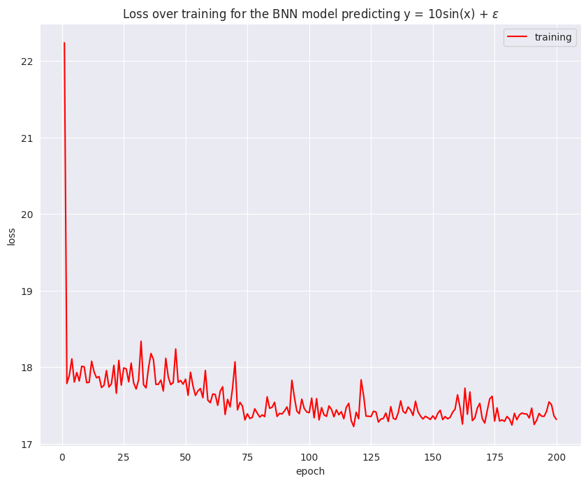
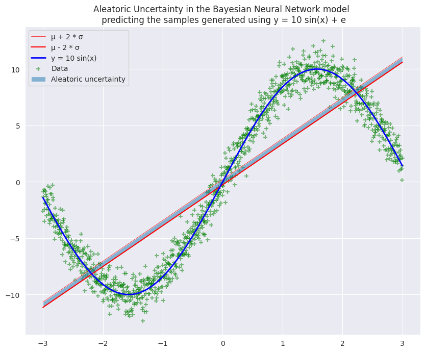
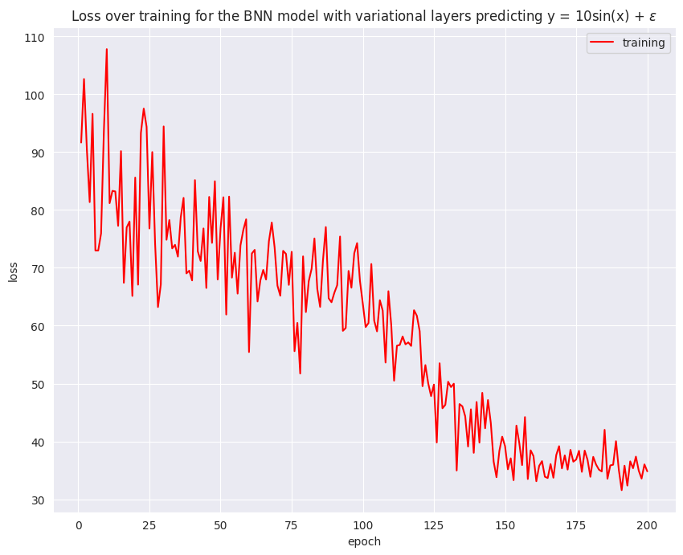
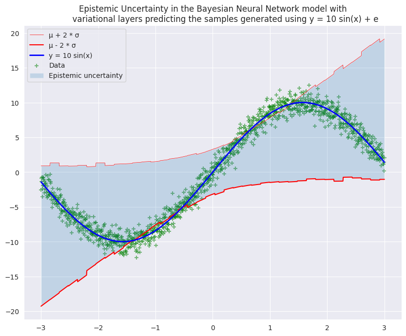
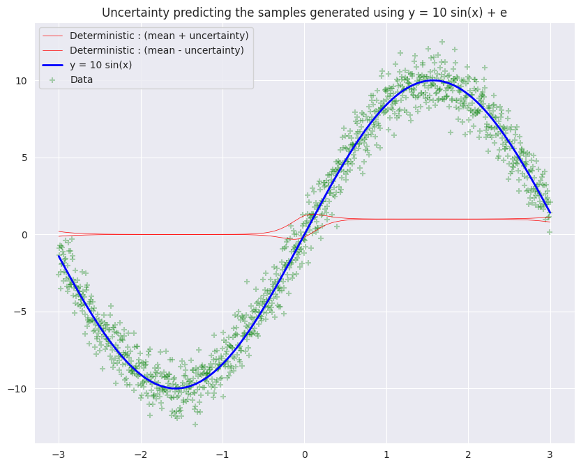

## Uncertainty Quantification for the toy dataset $y = 10 \sin{x} + \epsilon$

### 1. Import the libraries


```python
# This Source Code Form is subject to the terms of the MIT
# License. If a copy of the same was not distributed with this
# file, You can obtain one at
# https://github.com/akhilpandey95/uncertainty/blob/master/LICENSE.

import os
import scipy.stats
import pandas as pd
import numpy as np
import matplotlib.pyplot as plt
import seaborn as sns
import tensorflow as tf
from tensorflow.keras import backend as K
from tensorflow.keras.layers import Input, Dense, Layer, Dropout
from tensorflow.keras.models import Model
from tensorflow.keras.initializers import glorot_normal

##################################################################

tf.keras.backend.set_floatx("float64")
import tensorflow_probability as tfp
tfk = tf.keras
tfd = tfp.distributions
from tqdm import tqdm
from sklearn.preprocessing import StandardScaler, PolynomialFeatures
from sklearn.ensemble import IsolationForest
from sklearn.linear_model import LinearRegression
from sklearn.model_selection import train_test_split
from sklearn.metrics import r2_score, explained_variance_score, mean_squared_error
```

### 2. Generate the toy dataset, $y = 10\sin{x} + \epsilon$


```python
# define the function for generating the data
def f(x, sigma):
    epsilon = np.random.randn(*x.shape) * sigma
    return 10 * np.sin(x) + epsilon

# set the parameters for 
train_size = 1201
noise = 1.0

# generate the features and the labels
X = np.linspace(-3, 3, train_size).reshape(-1, 1)
y = f(X, sigma=noise)

# generate y values without any noise
y_true = f(X, sigma=0.0)

# split into training and test sets
X_train, X_test, y_train, y_test = train_test_split(X, y, test_size=0.33, random_state=2020)

print("Train data shape: " + str(X_train.shape))
print("Test data shape: " + str(X_test.shape))
```

    Train data shape: (804, 1)
    Test data shape: (397, 1)


```python
plt.figure(num=None, figsize=(10,8), dpi=100)
sns.set_style("darkgrid")
sns.plotting_context("talk", rc={"lines.linewidth": 2})

plt.plot(data_x, data_y, '+')
plt.plot(data_x, data_y_true, 'r')
plt.legend(['Data', 'y= 10 sin(x)'], loc = 'upper left')
plt.title('y = 10sin(x) + $\epsilon$')
plt.show()
```





### 2. Simple Feed forward Neural Networks

#### 2.1 Define the hyperparameters for running the FCN


```python
# Define some hyperparameters.
n_epochs = 50
n_samples = X.shape[0]
n_batches = 10
batch_size = np.floor(n_samples/n_batches)
buffer_size = n_samples

# Define training and test data sizes.
n_train = int(0.7*X.shape[0])

# Define dataset instance.
data = tf.data.Dataset.from_tensor_slices((X, y))

# Shuffle the data
data = data.shuffle(n_samples, reshuffle_each_iteration=True)

# Define train and test data instances.
train_data = data.take(n_train).batch(batch_size).repeat(n_epochs)
test_data = data.skip(n_train).batch(1).repeat(n_epochs)
```

#### 2.2 Data normalization

#### 2.3 Build the FCN model


```python
# Define model instance.
model_one = tfk.Sequential([
    tfk.layers.InputLayer(input_shape=(1,), name="input"),
    tfk.layers.Dense(256, activation="relu", name="dense_1"),
    tfk.layers.Dense(1, name="output")
], name="FCN")

# Compile model
model_one.compile(optimizer=tf.optimizers.Adam(learning_rate=0.001), loss='mse', metrics=['mse'])

# Describe model
model_one.summary()
```

    Model: "FCN"
    _________________________________________________________________
    Layer (type)                 Output Shape              Param #   
    =================================================================
    dense_1 (Dense)              (None, 256)               512       
    _________________________________________________________________
    output (Dense)               (None, 1)                 257       
    =================================================================
    Total params: 769
    Trainable params: 769
    Non-trainable params: 0
    _________________________________________________________________


#### 2.4 Train the FCN model


```python
# make sure the graph is reset
tf.compat.v1.reset_default_graph()

# compile and fit the model
model_one.fit(X, y, epochs=n_epochs, verbose=True)
```

    Epoch 1/50
    38/38 [==============================] - 0s 2ms/step - loss: 45.6371 - mse: 45.6371
    Epoch 2/50
    38/38 [==============================] - 0s 1ms/step - loss: 30.2224 - mse: 30.2224
    Epoch 3/50
    38/38 [==============================] - 0s 2ms/step - loss: 18.4188 - mse: 18.4188
    Epoch 4/50
    38/38 [==============================] - 0s 1ms/step - loss: 13.5382 - mse: 13.5382
    Epoch 5/50
    38/38 [==============================] - 0s 1ms/step - loss: 12.8470 - mse: 12.8470
    Epoch 6/50
    38/38 [==============================] - 0s 1ms/step - loss: 12.5990 - mse: 12.5990
    Epoch 7/50
    38/38 [==============================] - 0s 2ms/step - loss: 12.4101 - mse: 12.4101
    Epoch 8/50
    38/38 [==============================] - 0s 958us/step - loss: 12.2466 - mse: 12.2466
    Epoch 9/50
    38/38 [==============================] - 0s 986us/step - loss: 12.0704 - mse: 12.0704
    Epoch 10/50
    38/38 [==============================] - 0s 1ms/step - loss: 11.8838 - mse: 11.8838
    Epoch 11/50
    38/38 [==============================] - 0s 980us/step - loss: 11.6987 - mse: 11.6987
    Epoch 12/50
    38/38 [==============================] - 0s 991us/step - loss: 11.4651 - mse: 11.4651
    Epoch 13/50
    38/38 [==============================] - 0s 986us/step - loss: 11.2177 - mse: 11.2177
    Epoch 14/50
    38/38 [==============================] - 0s 983us/step - loss: 10.8550 - mse: 10.8550
    Epoch 15/50
    38/38 [==============================] - 0s 1ms/step - loss: 10.4341 - mse: 10.4341
    Epoch 16/50
    38/38 [==============================] - 0s 991us/step - loss: 9.9303 - mse: 9.9303
    Epoch 17/50
    38/38 [==============================] - 0s 1ms/step - loss: 9.3750 - mse: 9.3750
    Epoch 18/50
    38/38 [==============================] - 0s 982us/step - loss: 8.7943 - mse: 8.7943
    Epoch 19/50
    38/38 [==============================] - 0s 1ms/step - loss: 8.1702 - mse: 8.1702
    Epoch 20/50
    38/38 [==============================] - 0s 2ms/step - loss: 7.5210 - mse: 7.5210
    Epoch 21/50
    38/38 [==============================] - 0s 1ms/step - loss: 6.8647 - mse: 6.8647
    Epoch 22/50
    38/38 [==============================] - 0s 1ms/step - loss: 6.2043 - mse: 6.2043
    Epoch 23/50
    38/38 [==============================] - 0s 929us/step - loss: 5.5985 - mse: 5.5985
    Epoch 24/50
    38/38 [==============================] - 0s 911us/step - loss: 5.1200 - mse: 5.1200
    Epoch 25/50
    38/38 [==============================] - 0s 1ms/step - loss: 4.5313 - mse: 4.5313
    Epoch 26/50
    38/38 [==============================] - 0s 1ms/step - loss: 4.0488 - mse: 4.0488
    Epoch 27/50
    38/38 [==============================] - 0s 1ms/step - loss: 3.6178 - mse: 3.6178
    Epoch 28/50
    38/38 [==============================] - 0s 1ms/step - loss: 3.2474 - mse: 3.2474
    Epoch 29/50
    38/38 [==============================] - 0s 911us/step - loss: 2.9558 - mse: 2.9558
    Epoch 30/50
    38/38 [==============================] - 0s 933us/step - loss: 2.7035 - mse: 2.7035
    Epoch 31/50
    38/38 [==============================] - 0s 937us/step - loss: 2.4684 - mse: 2.4684
    Epoch 32/50
    38/38 [==============================] - 0s 930us/step - loss: 2.2687 - mse: 2.2687
    Epoch 33/50
    38/38 [==============================] - 0s 957us/step - loss: 2.1339 - mse: 2.1339
    Epoch 34/50
    38/38 [==============================] - 0s 2ms/step - loss: 2.0167 - mse: 2.0167
    Epoch 35/50
    38/38 [==============================] - 0s 1ms/step - loss: 1.8846 - mse: 1.8846
    Epoch 36/50
    38/38 [==============================] - 0s 1ms/step - loss: 1.8075 - mse: 1.8075
    Epoch 37/50
    38/38 [==============================] - 0s 1ms/step - loss: 1.7164 - mse: 1.7164
    Epoch 38/50
    38/38 [==============================] - 0s 1ms/step - loss: 1.6553 - mse: 1.6553
    Epoch 39/50
    38/38 [==============================] - 0s 1ms/step - loss: 1.5870 - mse: 1.5870
    Epoch 40/50
    38/38 [==============================] - 0s 1ms/step - loss: 1.5235 - mse: 1.5235
    Epoch 41/50
    38/38 [==============================] - 0s 1ms/step - loss: 1.4867 - mse: 1.4867
    Epoch 42/50
    38/38 [==============================] - 0s 1ms/step - loss: 1.4375 - mse: 1.4375
    Epoch 43/50
    38/38 [==============================] - 0s 1ms/step - loss: 1.4152 - mse: 1.4152
    Epoch 44/50
    38/38 [==============================] - 0s 2ms/step - loss: 1.3770 - mse: 1.3770
    Epoch 45/50
    38/38 [==============================] - 0s 1ms/step - loss: 1.3549 - mse: 1.3549
    Epoch 46/50
    38/38 [==============================] - 0s 985us/step - loss: 1.3272 - mse: 1.3272
    Epoch 47/50
    38/38 [==============================] - 0s 2ms/step - loss: 1.3266 - mse: 1.3266
    Epoch 48/50
    38/38 [==============================] - 0s 2ms/step - loss: 1.2893 - mse: 1.2893
    Epoch 49/50
    38/38 [==============================] - 0s 1ms/step - loss: 1.2717 - mse: 1.2717
    Epoch 50/50
    38/38 [==============================] - 0s 1ms/step - loss: 1.2657 - mse: 1.2657


    <tensorflow.python.keras.callbacks.History at 0x7fac6c3308d0>


#### 2.5 Plot the loss for the training session


```python
plt.figure(num=None, figsize=(10,8), dpi=100)
sns.set_style("darkgrid")
sns.plotting_context("talk", rc={"lines.linewidth": 2})

plt.xlabel("epoch")
plt.ylabel("loss")
plt.plot(list(map(lambda x: x + 1, model_one.history.epoch)), model_one.history.history["loss"], 'r', label="training")
plt.legend(loc='best')
plt.title('Loss over training for the FCN model predicting y = 10sin(x) + $\epsilon$')
plt.show()
```





#### 2.6 Plot the predictive means from the FCN model over the data


```python
y_preds = model_one.predict(X)
y_mean = np.mean(y_preds, axis=1)

plt.figure(num=None, figsize=(10,8), dpi=100)
sns.set_style("darkgrid")
sns.plotting_context("talk", rc={"lines.linewidth": 2})

plt.plot(X, y_mean, 'r-', label='Predictive mean from FCN', linewidth=2)
plt.scatter(X, y, marker='+', color='green', label='Data', alpha=0.5)
plt.plot(X, y_true, color='blue', label='y = 10 sin(x)', linewidth=2)
plt.title('FCN model predicting the samples generated using 10 sin(x) + e')
plt.legend();
```





### 3. Bayesian Neural Networks

#### 3.1 Define the hyperparameters for running the BNN


```python
# Define some hyperparameters.
n_epochs = 200
n_samples = X.shape[0]
n_batches = 10
batch_size = np.floor(n_samples/n_batches)
buffer_size = n_samples

# Define training and test data sizes.
n_train = int(0.7*X.shape[0])

# Define dataset instance.
data = tf.data.Dataset.from_tensor_slices((X, y))

# Shuffle the data
data = data.shuffle(n_samples, reshuffle_each_iteration=True)

# Define train and test data instances.
train_data = data.take(n_train).batch(batch_size).repeat(n_epochs)
test_data = data.skip(n_train).batch(1).repeat(n_epochs)
```

#### 3.2 Utility functions for building the bayesian neural **network**


```python
# Specify the prior over `keras.layers.Dense` `kernel` and `bias`.
def prior_trainable(kernel_size, bias_size=0, dtype=None):
    n = kernel_size + bias_size
    return tf.keras.Sequential([
      tfp.layers.VariableLayer(n, dtype=dtype),
      tfp.layers.DistributionLambda(lambda t: tfd.Independent(
          tfd.Normal(loc=t, scale=1),
          reinterpreted_batch_ndims=1))])

# Specify the surrogate posterior over `keras.layers.Dense` `kernel` and `bias`.
def posterior_mean_field(kernel_size, bias_size=0, dtype=None):
    n = kernel_size + bias_size
    c = np.log(np.expm1(1.))
    return tf.keras.Sequential([
      tfp.layers.VariableLayer(2 * n, dtype=dtype),
      tfp.layers.DistributionLambda(lambda t: tfd.Independent(
          tfd.Normal(loc=t[..., :n],
                     scale=1e-5 + tf.nn.softplus(c + t[..., n:])),
          reinterpreted_batch_ndims=1))])
```

#### 3.3 Build the Bayesian neural network


```python
# Define bayesian neural network model object
model_two = tf.keras.Sequential([
  # tfp.layers.DenseVariational(1 + 1, posterior_mean_field, prior_trainable),
  tfk.layers.Dense(256, name="dense_1"),
  tfk.layers.Dense(512, name="dense_2"),
  tfk.layers.Dense(1024, name="dense_3"),
  tfp.layers.DistributionLambda(lambda t: tfd.Normal(loc = t[..., :1], \
                                scale=1e-3 + tf.math.softplus(0.01 * t[..., 1:])))
], name="BNN")

# Compile model
model_two.compile(optimizer="adam", loss='mse',  metrics=['mse'])

# # Describe model
# model_two.summary()
```

#### 3.4 Train the Bayesian neural network


```python
# make sure the graph is reset
tf.compat.v1.reset_default_graph()

# train the model
model_two.fit(X, y, epochs=n_epochs, verbose=True)
```

    Epoch 1/200
    38/38 [==============================] - 0s 10ms/step - loss: 22.2357 - mse: 22.2357
    Epoch 2/200
    38/38 [==============================] - 0s 9ms/step - loss: 17.7868 - mse: 17.7868
    Epoch 3/200
    38/38 [==============================] - 0s 9ms/step - loss: 17.8962 - mse: 17.8962
    Epoch 4/200
    38/38 [==============================] - 0s 9ms/step - loss: 18.1085 - mse: 18.1085
    Epoch 5/200
    38/38 [==============================] - 0s 11ms/step - loss: 17.8051 - mse: 17.8051
    Epoch 6/200
    38/38 [==============================] - 0s 12ms/step - loss: 17.9300 - mse: 17.9300
    Epoch 7/200
    38/38 [==============================] - 0s 11ms/step - loss: 17.8191 - mse: 17.8191
    Epoch 8/200
    38/38 [==============================] - 0s 11ms/step - loss: 18.0118 - mse: 18.0118
    Epoch 9/200
    38/38 [==============================] - 0s 11ms/step - loss: 18.0043 - mse: 18.0043
    Epoch 10/200
    38/38 [==============================] - 0s 9ms/step - loss: 17.7978 - mse: 17.7978
    Epoch 11/200
    38/38 [==============================] - 0s 9ms/step - loss: 17.8010 - mse: 17.8010
    Epoch 12/200
    38/38 [==============================] - 0s 13ms/step - loss: 18.0774 - mse: 18.0774
    Epoch 13/200
    38/38 [==============================] - 0s 10ms/step - loss: 17.9380 - mse: 17.9380
    Epoch 14/200
    38/38 [==============================] - 0s 11ms/step - loss: 17.8601 - mse: 17.8601
    Epoch 15/200
    38/38 [==============================] - 0s 11ms/step - loss: 17.8778 - mse: 17.8778
    Epoch 16/200
    38/38 [==============================] - 0s 11ms/step - loss: 17.7340 - mse: 17.7340
    Epoch 17/200
    38/38 [==============================] - 0s 10ms/step - loss: 17.7623 - mse: 17.7623
    Epoch 18/200
    38/38 [==============================] - 0s 9ms/step - loss: 17.9550 - mse: 17.9550
    Epoch 19/200
    38/38 [==============================] - 0s 10ms/step - loss: 17.7400 - mse: 17.7400
    Epoch 20/200
    38/38 [==============================] - 0s 10ms/step - loss: 17.7813 - mse: 17.7813
    Epoch 21/200
    38/38 [==============================] - 1s 14ms/step - loss: 18.0237 - mse: 18.0237
    Epoch 22/200
    38/38 [==============================] - 0s 11ms/step - loss: 17.6588 - mse: 17.6588
    Epoch 23/200
    38/38 [==============================] - 0s 11ms/step - loss: 18.0883 - mse: 18.0883
    Epoch 24/200
    38/38 [==============================] - 0s 11ms/step - loss: 17.7648 - mse: 17.7648
    Epoch 25/200
    38/38 [==============================] - 1s 14ms/step - loss: 17.9901 - mse: 17.9901
    Epoch 26/200
    38/38 [==============================] - 1s 13ms/step - loss: 17.9782 - mse: 17.9782
    Epoch 27/200
    38/38 [==============================] - 0s 12ms/step - loss: 17.8082 - mse: 17.8082
    Epoch 28/200
    38/38 [==============================] - 0s 9ms/step - loss: 18.0529 - mse: 18.0529
    Epoch 29/200
    38/38 [==============================] - 0s 9ms/step - loss: 17.7941 - mse: 17.7941
    Epoch 30/200
    38/38 [==============================] - 0s 9ms/step - loss: 17.7144 - mse: 17.7144
    Epoch 31/200
    38/38 [==============================] - 1s 14ms/step - loss: 17.8315 - mse: 17.8315
    Epoch 32/200
    38/38 [==============================] - 1s 14ms/step - loss: 18.3383 - mse: 18.3383
    Epoch 33/200
    38/38 [==============================] - 1s 14ms/step - loss: 17.7711 - mse: 17.7711
    Epoch 34/200
    38/38 [==============================] - 1s 14ms/step - loss: 17.7291 - mse: 17.7291
    Epoch 35/200
    38/38 [==============================] - 1s 13ms/step - loss: 17.9886 - mse: 17.9886
    Epoch 36/200
    38/38 [==============================] - 1s 14ms/step - loss: 18.1785 - mse: 18.1785
    Epoch 37/200
    38/38 [==============================] - 1s 14ms/step - loss: 18.0998 - mse: 18.0998
    Epoch 38/200
    38/38 [==============================] - 1s 14ms/step - loss: 17.7759 - mse: 17.7759
    Epoch 39/200
    38/38 [==============================] - 0s 12ms/step - loss: 17.7754 - mse: 17.7754
    Epoch 40/200
    38/38 [==============================] - 0s 13ms/step - loss: 17.8313 - mse: 17.8313
    Epoch 41/200
    38/38 [==============================] - 0s 9ms/step - loss: 17.6889 - mse: 17.6889
    Epoch 42/200
    38/38 [==============================] - 1s 14ms/step - loss: 18.1155 - mse: 18.1155
    Epoch 43/200
    38/38 [==============================] - 0s 10ms/step - loss: 17.8712 - mse: 17.8712
    Epoch 44/200
    38/38 [==============================] - 0s 9ms/step - loss: 17.7717 - mse: 17.7717
    Epoch 45/200
    38/38 [==============================] - 0s 8ms/step - loss: 17.7981 - mse: 17.7981
    Epoch 46/200
    38/38 [==============================] - 0s 9ms/step - loss: 18.2375 - mse: 18.2375
    Epoch 47/200
    38/38 [==============================] - 0s 8ms/step - loss: 17.8024 - mse: 17.8024
    Epoch 48/200
    38/38 [==============================] - 0s 8ms/step - loss: 17.8258 - mse: 17.8258
    Epoch 49/200
    38/38 [==============================] - 0s 9ms/step - loss: 17.7773 - mse: 17.7773
    Epoch 50/200
    38/38 [==============================] - 0s 9ms/step - loss: 17.8435 - mse: 17.8435
    Epoch 51/200
    38/38 [==============================] - 0s 9ms/step - loss: 17.6327 - mse: 17.6327
    Epoch 52/200
    38/38 [==============================] - 0s 10ms/step - loss: 17.9333 - mse: 17.9333
    Epoch 53/200
    38/38 [==============================] - 0s 9ms/step - loss: 17.7548 - mse: 17.7548
    Epoch 54/200
    38/38 [==============================] - 0s 9ms/step - loss: 17.6300 - mse: 17.6300
    Epoch 55/200
    38/38 [==============================] - 0s 10ms/step - loss: 17.6893 - mse: 17.6893
    Epoch 56/200
    38/38 [==============================] - 0s 9ms/step - loss: 17.7204 - mse: 17.7204
    Epoch 57/200
    38/38 [==============================] - 0s 10ms/step - loss: 17.6004 - mse: 17.6004
    Epoch 58/200
    38/38 [==============================] - 0s 9ms/step - loss: 17.9570 - mse: 17.9570
    Epoch 59/200
    38/38 [==============================] - 0s 9ms/step - loss: 17.5688 - mse: 17.5688
    Epoch 60/200
    38/38 [==============================] - 1s 14ms/step - loss: 17.5356 - mse: 17.5356
    Epoch 61/200
    38/38 [==============================] - 0s 10ms/step - loss: 17.6496 - mse: 17.6496
    Epoch 62/200
    38/38 [==============================] - 0s 9ms/step - loss: 17.6435 - mse: 17.6435
    Epoch 63/200
    38/38 [==============================] - 0s 9ms/step - loss: 17.5016 - mse: 17.5016
    Epoch 64/200
    38/38 [==============================] - 0s 9ms/step - loss: 17.6846 - mse: 17.6846
    Epoch 65/200
    38/38 [==============================] - 0s 9ms/step - loss: 17.7443 - mse: 17.7443
    Epoch 66/200
    38/38 [==============================] - 0s 9ms/step - loss: 17.3820 - mse: 17.3820
    Epoch 67/200
    38/38 [==============================] - 0s 9ms/step - loss: 17.5796 - mse: 17.5796
    Epoch 68/200
    38/38 [==============================] - 0s 9ms/step - loss: 17.4804 - mse: 17.4804
    Epoch 69/200
    38/38 [==============================] - 0s 9ms/step - loss: 17.7270 - mse: 17.7270
    Epoch 70/200
    38/38 [==============================] - 0s 11ms/step - loss: 18.0694 - mse: 18.0694
    Epoch 71/200
    38/38 [==============================] - 0s 10ms/step - loss: 17.4414 - mse: 17.4414
    Epoch 72/200
    38/38 [==============================] - 0s 10ms/step - loss: 17.5395 - mse: 17.5395
    Epoch 73/200
    38/38 [==============================] - 0s 10ms/step - loss: 17.4924 - mse: 17.4924
    Epoch 74/200
    38/38 [==============================] - 0s 11ms/step - loss: 17.3106 - mse: 17.3106
    Epoch 75/200
    38/38 [==============================] - 0s 10ms/step - loss: 17.3913 - mse: 17.3913
    Epoch 76/200
    38/38 [==============================] - 0s 10ms/step - loss: 17.3297 - mse: 17.3297
    Epoch 77/200
    38/38 [==============================] - 0s 11ms/step - loss: 17.3449 - mse: 17.3449
    Epoch 78/200
    38/38 [==============================] - 0s 11ms/step - loss: 17.4563 - mse: 17.4563
    Epoch 79/200
    38/38 [==============================] - 0s 11ms/step - loss: 17.3984 - mse: 17.3984
    Epoch 80/200
    38/38 [==============================] - 0s 11ms/step - loss: 17.3479 - mse: 17.3479
    Epoch 81/200
    38/38 [==============================] - 0s 12ms/step - loss: 17.3759 - mse: 17.3759
    Epoch 82/200
    38/38 [==============================] - 0s 13ms/step - loss: 17.3546 - mse: 17.3546
    Epoch 83/200
    38/38 [==============================] - 0s 13ms/step - loss: 17.6123 - mse: 17.6123
    Epoch 84/200
    38/38 [==============================] - 0s 11ms/step - loss: 17.4627 - mse: 17.4627
    Epoch 85/200
    38/38 [==============================] - 0s 10ms/step - loss: 17.4763 - mse: 17.4763
    Epoch 86/200
    38/38 [==============================] - 0s 10ms/step - loss: 17.5418 - mse: 17.5418
    Epoch 87/200
    38/38 [==============================] - 0s 10ms/step - loss: 17.3563 - mse: 17.3563
    Epoch 88/200
    38/38 [==============================] - 0s 10ms/step - loss: 17.3963 - mse: 17.3963
    Epoch 89/200
    38/38 [==============================] - 0s 10ms/step - loss: 17.3886 - mse: 17.3886
    Epoch 90/200
    38/38 [==============================] - 0s 10ms/step - loss: 17.4277 - mse: 17.4277
    Epoch 91/200
    38/38 [==============================] - 1s 15ms/step - loss: 17.4808 - mse: 17.4808
    Epoch 92/200
    38/38 [==============================] - 0s 12ms/step - loss: 17.3712 - mse: 17.3712
    Epoch 93/200
    38/38 [==============================] - 1s 14ms/step - loss: 17.8286 - mse: 17.8286
    Epoch 94/200
    38/38 [==============================] - 1s 14ms/step - loss: 17.6080 - mse: 17.6080
    Epoch 95/200
    38/38 [==============================] - 0s 10ms/step - loss: 17.4268 - mse: 17.4268
    Epoch 96/200
    38/38 [==============================] - 0s 13ms/step - loss: 17.3923 - mse: 17.3923
    Epoch 97/200
    38/38 [==============================] - 1s 14ms/step - loss: 17.5826 - mse: 17.5826
    Epoch 98/200
    38/38 [==============================] - 1s 14ms/step - loss: 17.4597 - mse: 17.4597
    Epoch 99/200
    38/38 [==============================] - 0s 10ms/step - loss: 17.4153 - mse: 17.4153
    Epoch 100/200
    38/38 [==============================] - 0s 9ms/step - loss: 17.4052 - mse: 17.4052
    Epoch 101/200
    38/38 [==============================] - 1s 14ms/step - loss: 17.5957 - mse: 17.5957
    Epoch 102/200
    38/38 [==============================] - 0s 11ms/step - loss: 17.3382 - mse: 17.3382
    Epoch 103/200
    38/38 [==============================] - 0s 11ms/step - loss: 17.5894 - mse: 17.5894
    Epoch 104/200
    38/38 [==============================] - 0s 11ms/step - loss: 17.3114 - mse: 17.3114
    Epoch 105/200
    38/38 [==============================] - 0s 12ms/step - loss: 17.4714 - mse: 17.4714
    Epoch 106/200
    38/38 [==============================] - 0s 12ms/step - loss: 17.3775 - mse: 17.3775
    Epoch 107/200
    38/38 [==============================] - 0s 11ms/step - loss: 17.3571 - mse: 17.3571
    Epoch 108/200
    38/38 [==============================] - 0s 11ms/step - loss: 17.4941 - mse: 17.4941
    Epoch 109/200
    38/38 [==============================] - 0s 11ms/step - loss: 17.4490 - mse: 17.4490
    Epoch 110/200
    38/38 [==============================] - 0s 11ms/step - loss: 17.3516 - mse: 17.3516
    Epoch 111/200
    38/38 [==============================] - 0s 11ms/step - loss: 17.4427 - mse: 17.4427
    Epoch 112/200
    38/38 [==============================] - 0s 11ms/step - loss: 17.3779 - mse: 17.3779
    Epoch 113/200
    38/38 [==============================] - 0s 12ms/step - loss: 17.4187 - mse: 17.4187
    Epoch 114/200
    38/38 [==============================] - 0s 12ms/step - loss: 17.3258 - mse: 17.3258
    Epoch 115/200
    38/38 [==============================] - 0s 12ms/step - loss: 17.4748 - mse: 17.4748
    Epoch 116/200
    38/38 [==============================] - 1s 15ms/step - loss: 17.5276 - mse: 17.5276
    Epoch 117/200
    38/38 [==============================] - 1s 16ms/step - loss: 17.3020 - mse: 17.3020
    Epoch 118/200
    38/38 [==============================] - 1s 15ms/step - loss: 17.2241 - mse: 17.2241
    Epoch 119/200
    38/38 [==============================] - 1s 15ms/step - loss: 17.4117 - mse: 17.4117
    Epoch 120/200
    38/38 [==============================] - 0s 12ms/step - loss: 17.3259 - mse: 17.3259
    Epoch 121/200
    38/38 [==============================] - 0s 11ms/step - loss: 17.8352 - mse: 17.8352
    Epoch 122/200
    38/38 [==============================] - 1s 14ms/step - loss: 17.6312 - mse: 17.6312
    Epoch 123/200
    38/38 [==============================] - 0s 11ms/step - loss: 17.3597 - mse: 17.3597
    Epoch 124/200
    38/38 [==============================] - 0s 11ms/step - loss: 17.3594 - mse: 17.3594
    Epoch 125/200
    38/38 [==============================] - 1s 14ms/step - loss: 17.3538 - mse: 17.3538
    Epoch 126/200
    38/38 [==============================] - 0s 11ms/step - loss: 17.4238 - mse: 17.4238
    Epoch 127/200
    38/38 [==============================] - 0s 11ms/step - loss: 17.4148 - mse: 17.4148
    Epoch 128/200
    38/38 [==============================] - 1s 14ms/step - loss: 17.2827 - mse: 17.2827
    Epoch 129/200
    38/38 [==============================] - 1s 15ms/step - loss: 17.3225 - mse: 17.3225
    Epoch 130/200
    38/38 [==============================] - 1s 15ms/step - loss: 17.3297 - mse: 17.3297
    Epoch 131/200
    38/38 [==============================] - 0s 12ms/step - loss: 17.4014 - mse: 17.4014
    Epoch 132/200
    38/38 [==============================] - 0s 13ms/step - loss: 17.2908 - mse: 17.2908
    Epoch 133/200
    38/38 [==============================] - 0s 11ms/step - loss: 17.4844 - mse: 17.4844
    Epoch 134/200
    38/38 [==============================] - 0s 10ms/step - loss: 17.3322 - mse: 17.3322
    Epoch 135/200
    38/38 [==============================] - 0s 9ms/step - loss: 17.3174 - mse: 17.3174
    Epoch 136/200
    38/38 [==============================] - 0s 9ms/step - loss: 17.4031 - mse: 17.4031
    Epoch 137/200
    38/38 [==============================] - 0s 10ms/step - loss: 17.5599 - mse: 17.5599
    Epoch 138/200
    38/38 [==============================] - 0s 13ms/step - loss: 17.4220 - mse: 17.4220
    Epoch 139/200
    38/38 [==============================] - 1s 14ms/step - loss: 17.3976 - mse: 17.3976
    Epoch 140/200
    38/38 [==============================] - 1s 14ms/step - loss: 17.4800 - mse: 17.4800
    Epoch 141/200
    38/38 [==============================] - 0s 12ms/step - loss: 17.4405 - mse: 17.4405: 0s - loss: 17.7012 - mse:
    Epoch 142/200
    38/38 [==============================] - 0s 11ms/step - loss: 17.3690 - mse: 17.3690
    Epoch 143/200
    38/38 [==============================] - 0s 11ms/step - loss: 17.5547 - mse: 17.5547
    Epoch 144/200
    38/38 [==============================] - 0s 12ms/step - loss: 17.4181 - mse: 17.4181
    Epoch 145/200
    38/38 [==============================] - 1s 14ms/step - loss: 17.3617 - mse: 17.3617
    Epoch 146/200
    38/38 [==============================] - 1s 14ms/step - loss: 17.3232 - mse: 17.3232
    Epoch 147/200
    38/38 [==============================] - 1s 14ms/step - loss: 17.3585 - mse: 17.3585
    Epoch 148/200
    38/38 [==============================] - 0s 10ms/step - loss: 17.3396 - mse: 17.3396
    Epoch 149/200
    38/38 [==============================] - 0s 9ms/step - loss: 17.3172 - mse: 17.3172
    Epoch 150/200
    38/38 [==============================] - 0s 9ms/step - loss: 17.3638 - mse: 17.3638
    Epoch 151/200
    38/38 [==============================] - 0s 13ms/step - loss: 17.3200 - mse: 17.3200
    Epoch 152/200
    38/38 [==============================] - 1s 15ms/step - loss: 17.3972 - mse: 17.3972
    Epoch 153/200
    38/38 [==============================] - 0s 12ms/step - loss: 17.4368 - mse: 17.4368
    Epoch 154/200
    38/38 [==============================] - 1s 13ms/step - loss: 17.3149 - mse: 17.3149
    Epoch 155/200
    38/38 [==============================] - 1s 15ms/step - loss: 17.3543 - mse: 17.3543
    Epoch 156/200
    38/38 [==============================] - 0s 12ms/step - loss: 17.3251 - mse: 17.3251
    Epoch 157/200
    38/38 [==============================] - 0s 10ms/step - loss: 17.3447 - mse: 17.3447
    Epoch 158/200
    38/38 [==============================] - 0s 11ms/step - loss: 17.4096 - mse: 17.4096
    Epoch 159/200
    38/38 [==============================] - 0s 12ms/step - loss: 17.4514 - mse: 17.4514
    Epoch 160/200
    38/38 [==============================] - 0s 11ms/step - loss: 17.6391 - mse: 17.6391
    Epoch 161/200
    38/38 [==============================] - 0s 10ms/step - loss: 17.4748 - mse: 17.4748
    Epoch 162/200
    38/38 [==============================] - 0s 12ms/step - loss: 17.2561 - mse: 17.2561
    Epoch 163/200
    38/38 [==============================] - 0s 11ms/step - loss: 17.7256 - mse: 17.7256
    Epoch 164/200
    38/38 [==============================] - 0s 10ms/step - loss: 17.3847 - mse: 17.3847
    Epoch 165/200
    38/38 [==============================] - 0s 10ms/step - loss: 17.6762 - mse: 17.6762
    Epoch 166/200
    38/38 [==============================] - 0s 11ms/step - loss: 17.3018 - mse: 17.3018
    Epoch 167/200
    38/38 [==============================] - 0s 10ms/step - loss: 17.3361 - mse: 17.3361
    Epoch 168/200
    38/38 [==============================] - 0s 11ms/step - loss: 17.4651 - mse: 17.4651
    Epoch 169/200
    38/38 [==============================] - 0s 10ms/step - loss: 17.5274 - mse: 17.5274
    Epoch 170/200
    38/38 [==============================] - 0s 11ms/step - loss: 17.3282 - mse: 17.3282
    Epoch 171/200
    38/38 [==============================] - 0s 11ms/step - loss: 17.2702 - mse: 17.2702
    Epoch 172/200
    38/38 [==============================] - 0s 13ms/step - loss: 17.4314 - mse: 17.4314
    Epoch 173/200
    38/38 [==============================] - 0s 12ms/step - loss: 17.5846 - mse: 17.5846
    Epoch 174/200
    38/38 [==============================] - 0s 11ms/step - loss: 17.6198 - mse: 17.6198
    Epoch 175/200
    38/38 [==============================] - 0s 11ms/step - loss: 17.2959 - mse: 17.2959
    Epoch 176/200
    38/38 [==============================] - 0s 11ms/step - loss: 17.4685 - mse: 17.4685
    Epoch 177/200
    38/38 [==============================] - 0s 11ms/step - loss: 17.2963 - mse: 17.2963
    Epoch 178/200
    38/38 [==============================] - 0s 12ms/step - loss: 17.3119 - mse: 17.3119
    Epoch 179/200
    38/38 [==============================] - 0s 11ms/step - loss: 17.2929 - mse: 17.2929
    Epoch 180/200
    38/38 [==============================] - 0s 11ms/step - loss: 17.3556 - mse: 17.3556
    Epoch 181/200
    38/38 [==============================] - 0s 11ms/step - loss: 17.3229 - mse: 17.3229
    Epoch 182/200
    38/38 [==============================] - 0s 10ms/step - loss: 17.2438 - mse: 17.2438
    Epoch 183/200
    38/38 [==============================] - 0s 10ms/step - loss: 17.3969 - mse: 17.3969
    Epoch 184/200
    38/38 [==============================] - 0s 11ms/step - loss: 17.3132 - mse: 17.3132
    Epoch 185/200
    38/38 [==============================] - 0s 10ms/step - loss: 17.3760 - mse: 17.3760
    Epoch 186/200
    38/38 [==============================] - 0s 11ms/step - loss: 17.4008 - mse: 17.4008
    Epoch 187/200
    38/38 [==============================] - 0s 12ms/step - loss: 17.3905 - mse: 17.3905
    Epoch 188/200
    38/38 [==============================] - 0s 12ms/step - loss: 17.3881 - mse: 17.3881
    Epoch 189/200
    38/38 [==============================] - 0s 11ms/step - loss: 17.3367 - mse: 17.3367
    Epoch 190/200
    38/38 [==============================] - 0s 11ms/step - loss: 17.4653 - mse: 17.4653
    Epoch 191/200
    38/38 [==============================] - 0s 12ms/step - loss: 17.2510 - mse: 17.2510
    Epoch 192/200
    38/38 [==============================] - 0s 11ms/step - loss: 17.3074 - mse: 17.3074
    Epoch 193/200
    38/38 [==============================] - 0s 11ms/step - loss: 17.3953 - mse: 17.3953
    Epoch 194/200
    38/38 [==============================] - 0s 11ms/step - loss: 17.3597 - mse: 17.3597
    Epoch 195/200
    38/38 [==============================] - 0s 11ms/step - loss: 17.3571 - mse: 17.3571
    Epoch 196/200
    38/38 [==============================] - 0s 12ms/step - loss: 17.4223 - mse: 17.4223
    Epoch 197/200
    38/38 [==============================] - 0s 12ms/step - loss: 17.5465 - mse: 17.5465
    Epoch 198/200
    38/38 [==============================] - 0s 12ms/step - loss: 17.5096 - mse: 17.5096
    Epoch 199/200
    38/38 [==============================] - 0s 12ms/step - loss: 17.3636 - mse: 17.3636
    Epoch 200/200
    38/38 [==============================] - 1s 14ms/step - loss: 17.3170 - mse: 17.3170


    <tensorflow.python.keras.callbacks.History at 0x7fac48679c18>


#### 3.5 Plot the training session for the BNN model


```python
plt.figure(num=None, figsize=(10,8), dpi=100)
sns.set_style("darkgrid")
sns.plotting_context("talk", rc={"lines.linewidth": 2})

plt.xlabel("epoch")
plt.ylabel("loss")
plt.plot(list(map(lambda x: x + 1, model_two.history.epoch)), model_two.history.history["loss"], 'r', label="training")
# plt.plot(list(map(lambda x: x + 1, model_two.history.epoch)), model_two.history.history["val_loss"], 'b', label="validation")
plt.legend(loc='best')
plt.title('Loss over training for the BNN model predicting y = 10sin(x) + $\epsilon$')
plt.show()
```





#### 3.6 Obtain the predictions for the BNN model


```python
y_pred_list = []

for i in tqdm(range(X.shape[0])):
    y_pred = model_two.predict(X)
    y_pred_list.append(y_pred)
    
y_preds = np.concatenate(y_pred_list, axis=1)

y_mean = np.mean(y_preds, axis=1)
y_sigma = np.std(y_preds, axis=1)
```

    100%|██████████| 1201/1201 [04:20<00:00,  4.62it/s]


#### 3.7 Plot the aleatoric uncertainty for the BNN model over the data


```python
plt.figure(num=None, figsize=(10,8), dpi=100)
sns.set_style("darkgrid")
sns.plotting_context("talk", rc={"lines.linewidth": 2})

plt.plot(X, y_mean +  2 * y_sigma, color='r', label='μ + 2 * σ', linewidth=0.5)
plt.plot(X, y_mean -  2 * y_sigma, color='r', label='μ - 2 * σ', linewidth=1.5)
plt.scatter(X, y, marker='+', color='green', label='Data', alpha=0.5)
plt.plot(X, y_true, color='blue', label='y = 10 sin(x)', linewidth=2)
plt.fill_between(X.ravel(), 
                 y_mean +  2 * y_sigma, 
                 y_mean -  2 * y_sigma, 
                 alpha=0.5, label='Aleatoric uncertainty')
plt.title('Aleatoric Uncertainty in the Bayesian Neural Network model \n predicting the samples generated using y = 10 sin(x) + e')
plt.legend();
```





#### 3.8 Build the BNN model with variational layers


```python
# Define bayesian neural network model object
model_three = tf.keras.Sequential([
    tfp.layers.DenseVariational(10, posterior_mean_field, prior_trainable),
    tfp.layers.DenseVariational(1, posterior_mean_field, prior_trainable),
#     tfp.layers.DistributionLambda(lambda t: tfd.Normal(loc=t, scale=1))
], name="BNN_variational")

# Compile model
model_three.compile(optimizer="adam", loss='mse',  metrics=['mse'])

# # Describe model
# model_two.summary()
```

#### 3.9 Train the BNN model with variational layers


```python
# make sure the graph is reset
tf.compat.v1.reset_default_graph()

# train the model
model_three.fit(X, y, epochs=n_epochs, verbose=True)
```

    Epoch 1/200
    38/38 [==============================] - 0s 1ms/step - loss: 91.6685 - mse: 91.6684
    Epoch 2/200
    38/38 [==============================] - 0s 1ms/step - loss: 102.6543 - mse: 102.6485
    Epoch 3/200
    38/38 [==============================] - 0s 2ms/step - loss: 90.5057 - mse: 90.4811
    Epoch 4/200
    38/38 [==============================] - 0s 1ms/step - loss: 81.3664 - mse: 81.3314
    Epoch 5/200
    38/38 [==============================] - 0s 1ms/step - loss: 96.6333 - mse: 96.5908
    Epoch 6/200
    38/38 [==============================] - 0s 2ms/step - loss: 73.0019 - mse: 72.9721
    Epoch 7/200
    38/38 [==============================] - 0s 1ms/step - loss: 72.9975 - mse: 72.8969
    Epoch 8/200
    38/38 [==============================] - 0s 1ms/step - loss: 75.9515 - mse: 75.8692
    Epoch 9/200
    38/38 [==============================] - 0s 918us/step - loss: 93.8633 - mse: 93.8385
    Epoch 10/200
    38/38 [==============================] - 0s 923us/step - loss: 107.8171 - mse: 107.6497
    Epoch 11/200
    38/38 [==============================] - 0s 2ms/step - loss: 81.1835 - mse: 81.1525
    Epoch 12/200
    38/38 [==============================] - 0s 1ms/step - loss: 83.3133 - mse: 83.2108
    Epoch 13/200
    38/38 [==============================] - 0s 1ms/step - loss: 83.2135 - mse: 83.0015
    Epoch 14/200
    38/38 [==============================] - 0s 2ms/step - loss: 77.2659 - mse: 77.1888
    Epoch 15/200
    38/38 [==============================] - 0s 2ms/step - loss: 90.1806 - mse: 90.0387
    Epoch 16/200
    38/38 [==============================] - 0s 2ms/step - loss: 67.4215 - mse: 67.2296
    Epoch 17/200
    38/38 [==============================] - 0s 1ms/step - loss: 76.9821 - mse: 76.9135
    Epoch 18/200
    38/38 [==============================] - 0s 1ms/step - loss: 78.0107 - mse: 77.8454
    Epoch 19/200
    38/38 [==============================] - 0s 906us/step - loss: 65.1407 - mse: 64.8918
    Epoch 20/200
    38/38 [==============================] - 0s 899us/step - loss: 85.6119 - mse: 85.3081
    Epoch 21/200
    38/38 [==============================] - 0s 933us/step - loss: 67.0933 - mse: 66.8667
    Epoch 22/200
    38/38 [==============================] - 0s 900us/step - loss: 93.3317 - mse: 93.0087
    Epoch 23/200
    38/38 [==============================] - 0s 898us/step - loss: 97.5334 - mse: 97.2877
    Epoch 24/200
    38/38 [==============================] - 0s 899us/step - loss: 94.3806 - mse: 94.1420
    Epoch 25/200
    38/38 [==============================] - 0s 980us/step - loss: 76.8029 - mse: 76.5165
    Epoch 26/200
    38/38 [==============================] - 0s 907us/step - loss: 90.0174 - mse: 89.6896
    Epoch 27/200
    38/38 [==============================] - 0s 907us/step - loss: 74.0921 - mse: 73.6519
    Epoch 28/200
    38/38 [==============================] - 0s 2ms/step - loss: 63.2248 - mse: 62.8035
    Epoch 29/200
    38/38 [==============================] - 0s 2ms/step - loss: 67.1417 - mse: 66.6146
    Epoch 30/200
    38/38 [==============================] - 0s 1ms/step - loss: 94.4506 - mse: 94.0902
    Epoch 31/200
    38/38 [==============================] - 0s 2ms/step - loss: 74.8562 - mse: 74.4553
    Epoch 32/200
    38/38 [==============================] - 0s 2ms/step - loss: 78.2690 - mse: 77.5498
    Epoch 33/200
    38/38 [==============================] - 0s 2ms/step - loss: 73.3639 - mse: 72.7249
    Epoch 34/200
    38/38 [==============================] - 0s 1ms/step - loss: 73.9841 - mse: 73.4863
    Epoch 35/200
    38/38 [==============================] - 0s 1ms/step - loss: 71.9482 - mse: 71.2587
    Epoch 36/200
    38/38 [==============================] - 0s 1ms/step - loss: 78.7086 - mse: 77.8957
    Epoch 37/200
    38/38 [==============================] - 0s 1ms/step - loss: 82.1003 - mse: 81.4836
    Epoch 38/200
    38/38 [==============================] - 0s 1ms/step - loss: 69.0389 - mse: 68.4672
    Epoch 39/200
    38/38 [==============================] - 0s 1ms/step - loss: 69.5106 - mse: 68.7291
    Epoch 40/200
    38/38 [==============================] - 0s 2ms/step - loss: 67.8327 - mse: 67.1951
    Epoch 41/200
    38/38 [==============================] - 0s 1ms/step - loss: 85.1724 - mse: 84.5794
    Epoch 42/200
    38/38 [==============================] - 0s 2ms/step - loss: 72.8583 - mse: 72.0488
    Epoch 43/200
    38/38 [==============================] - 0s 2ms/step - loss: 71.1923 - mse: 70.1290
    Epoch 44/200
    38/38 [==============================] - 0s 2ms/step - loss: 76.8127 - mse: 75.6638
    Epoch 45/200
    38/38 [==============================] - 0s 2ms/step - loss: 66.5197 - mse: 65.7248
    Epoch 46/200
    38/38 [==============================] - 0s 1ms/step - loss: 82.2628 - mse: 81.6052
    Epoch 47/200
    38/38 [==============================] - 0s 2ms/step - loss: 74.3202 - mse: 73.4986
    Epoch 48/200
    38/38 [==============================] - 0s 2ms/step - loss: 84.9802 - mse: 84.1525
    Epoch 49/200
    38/38 [==============================] - 0s 2ms/step - loss: 67.9937 - mse: 67.1479
    Epoch 50/200
    38/38 [==============================] - 0s 2ms/step - loss: 76.8001 - mse: 75.7328
    Epoch 51/200
    38/38 [==============================] - 0s 1ms/step - loss: 82.2058 - mse: 80.3660
    Epoch 52/200
    38/38 [==============================] - 0s 1ms/step - loss: 61.9301 - mse: 60.9919
    Epoch 53/200
    38/38 [==============================] - 0s 1ms/step - loss: 82.3166 - mse: 81.3550
    Epoch 54/200
    38/38 [==============================] - 0s 1ms/step - loss: 68.3116 - mse: 67.0319
    Epoch 55/200
    38/38 [==============================] - 0s 2ms/step - loss: 72.6145 - mse: 71.4483
    Epoch 56/200
    38/38 [==============================] - 0s 1ms/step - loss: 65.5486 - mse: 64.3451
    Epoch 57/200
    38/38 [==============================] - 0s 2ms/step - loss: 73.8833 - mse: 72.6097
    Epoch 58/200
    38/38 [==============================] - 0s 2ms/step - loss: 76.5458 - mse: 75.3718
    Epoch 59/200
    38/38 [==============================] - 0s 1ms/step - loss: 78.3945 - mse: 77.4585
    Epoch 60/200
    38/38 [==============================] - 0s 2ms/step - loss: 55.4421 - mse: 54.1704
    Epoch 61/200
    38/38 [==============================] - 0s 2ms/step - loss: 72.4848 - mse: 71.2003
    Epoch 62/200
    38/38 [==============================] - 0s 2ms/step - loss: 73.1096 - mse: 72.0470
    Epoch 63/200
    38/38 [==============================] - 0s 1ms/step - loss: 64.1919 - mse: 62.5695
    Epoch 64/200
    38/38 [==============================] - 0s 2ms/step - loss: 67.8508 - mse: 66.3900
    Epoch 65/200
    38/38 [==============================] - 0s 1ms/step - loss: 69.6486 - mse: 68.7353
    Epoch 66/200
    38/38 [==============================] - 0s 2ms/step - loss: 67.9798 - mse: 66.4128
    Epoch 67/200
    38/38 [==============================] - 0s 912us/step - loss: 74.6244 - mse: 72.9453
    Epoch 68/200
    38/38 [==============================] - 0s 2ms/step - loss: 77.8358 - mse: 76.5617
    Epoch 69/200
    38/38 [==============================] - 0s 1ms/step - loss: 73.5384 - mse: 72.2392
    Epoch 70/200
    38/38 [==============================] - 0s 1ms/step - loss: 66.9299 - mse: 64.8465
    Epoch 71/200
    38/38 [==============================] - 0s 2ms/step - loss: 65.1857 - mse: 63.2062
    Epoch 72/200
    38/38 [==============================] - 0s 901us/step - loss: 72.9434 - mse: 70.7342
    Epoch 73/200
    38/38 [==============================] - 0s 977us/step - loss: 72.4111 - mse: 70.6640
    Epoch 74/200
    38/38 [==============================] - 0s 2ms/step - loss: 67.0563 - mse: 65.1656
    Epoch 75/200
    38/38 [==============================] - 0s 1ms/step - loss: 72.7769 - mse: 70.8807
    Epoch 76/200
    38/38 [==============================] - 0s 1ms/step - loss: 55.5914 - mse: 54.0630
    Epoch 77/200
    38/38 [==============================] - 0s 1ms/step - loss: 60.4820 - mse: 58.3136
    Epoch 78/200
    38/38 [==============================] - 0s 1ms/step - loss: 51.7227 - mse: 50.4288
    Epoch 79/200
    38/38 [==============================] - 0s 1ms/step - loss: 71.9868 - mse: 70.0712
    Epoch 80/200
    38/38 [==============================] - 0s 2ms/step - loss: 62.3547 - mse: 60.2846
    Epoch 81/200
    38/38 [==============================] - 0s 2ms/step - loss: 67.7017 - mse: 65.5285
    Epoch 82/200
    38/38 [==============================] - 0s 2ms/step - loss: 69.8236 - mse: 68.0016
    Epoch 83/200
    38/38 [==============================] - 0s 1ms/step - loss: 75.0878 - mse: 72.9332
    Epoch 84/200
    38/38 [==============================] - 0s 1ms/step - loss: 66.3666 - mse: 64.2115
    Epoch 85/200
    38/38 [==============================] - 0s 922us/step - loss: 63.2534 - mse: 61.0158
    Epoch 86/200
    38/38 [==============================] - 0s 1ms/step - loss: 71.3076 - mse: 68.9464
    Epoch 87/200
    38/38 [==============================] - 0s 2ms/step - loss: 77.0554 - mse: 74.6923
    Epoch 88/200
    38/38 [==============================] - 0s 2ms/step - loss: 64.7433 - mse: 62.8051
    Epoch 89/200
    38/38 [==============================] - 0s 1ms/step - loss: 64.0547 - mse: 62.0920
    Epoch 90/200
    38/38 [==============================] - 0s 1ms/step - loss: 65.6927 - mse: 63.5264
    Epoch 91/200
    38/38 [==============================] - 0s 1ms/step - loss: 67.0049 - mse: 64.5519
    Epoch 92/200
    38/38 [==============================] - 0s 1ms/step - loss: 75.4180 - mse: 73.6937
    Epoch 93/200
    38/38 [==============================] - 0s 2ms/step - loss: 59.1128 - mse: 56.4455
    Epoch 94/200
    38/38 [==============================] - 0s 2ms/step - loss: 59.5974 - mse: 57.5437
    Epoch 95/200
    38/38 [==============================] - 0s 1ms/step - loss: 69.4679 - mse: 67.7275
    Epoch 96/200
    38/38 [==============================] - 0s 1ms/step - loss: 66.5696 - mse: 64.1363
    Epoch 97/200
    38/38 [==============================] - 0s 2ms/step - loss: 72.5292 - mse: 70.2517
    Epoch 98/200
    38/38 [==============================] - 0s 1ms/step - loss: 74.2795 - mse: 71.7442
    Epoch 99/200
    38/38 [==============================] - 0s 1ms/step - loss: 67.7147 - mse: 65.2770
    Epoch 100/200
    38/38 [==============================] - 0s 1ms/step - loss: 63.8349 - mse: 61.3881
    Epoch 101/200
    38/38 [==============================] - 0s 1ms/step - loss: 59.7656 - mse: 57.5644
    Epoch 102/200
    38/38 [==============================] - 0s 1ms/step - loss: 60.4542 - mse: 57.5826
    Epoch 103/200
    38/38 [==============================] - 0s 1ms/step - loss: 70.6643 - mse: 67.8994
    Epoch 104/200
    38/38 [==============================] - 0s 1ms/step - loss: 60.8768 - mse: 58.4905
    Epoch 105/200
    38/38 [==============================] - 0s 1ms/step - loss: 59.0165 - mse: 55.7699
    Epoch 106/200
    38/38 [==============================] - 0s 1ms/step - loss: 64.4125 - mse: 62.3447
    Epoch 107/200
    38/38 [==============================] - 0s 1ms/step - loss: 62.6097 - mse: 59.8748
    Epoch 108/200
    38/38 [==============================] - 0s 1ms/step - loss: 53.6314 - mse: 50.2201
    Epoch 109/200
    38/38 [==============================] - 0s 1ms/step - loss: 65.9662 - mse: 63.1616
    Epoch 110/200
    38/38 [==============================] - 0s 1ms/step - loss: 60.1230 - mse: 57.2489
    Epoch 111/200
    38/38 [==============================] - 0s 1ms/step - loss: 50.4909 - mse: 47.3311
    Epoch 112/200
    38/38 [==============================] - 0s 1ms/step - loss: 56.5376 - mse: 53.6009
    Epoch 113/200
    38/38 [==============================] - 0s 1ms/step - loss: 56.6763 - mse: 53.3987
    Epoch 114/200
    38/38 [==============================] - 0s 1ms/step - loss: 58.1383 - mse: 54.9726
    Epoch 115/200
    38/38 [==============================] - 0s 1ms/step - loss: 56.7783 - mse: 53.6972
    Epoch 116/200
    38/38 [==============================] - 0s 1ms/step - loss: 57.1137 - mse: 53.1924
    Epoch 117/200
    38/38 [==============================] - 0s 1ms/step - loss: 56.5023 - mse: 53.7215
    Epoch 118/200
    38/38 [==============================] - 0s 1ms/step - loss: 62.6780 - mse: 59.3283
    Epoch 119/200
    38/38 [==============================] - 0s 1ms/step - loss: 61.7190 - mse: 58.6891
    Epoch 120/200
    38/38 [==============================] - 0s 1ms/step - loss: 59.0458 - mse: 55.5745
    Epoch 121/200
    38/38 [==============================] - 0s 2ms/step - loss: 49.5373 - mse: 46.4358
    Epoch 122/200
    38/38 [==============================] - 0s 1ms/step - loss: 53.1880 - mse: 50.0346
    Epoch 123/200
    38/38 [==============================] - 0s 1ms/step - loss: 50.0196 - mse: 46.4706
    Epoch 124/200
    38/38 [==============================] - 0s 2ms/step - loss: 47.8248 - mse: 44.3729
    Epoch 125/200
    38/38 [==============================] - 0s 2ms/step - loss: 49.8211 - mse: 46.4725
    Epoch 126/200
    38/38 [==============================] - 0s 2ms/step - loss: 39.8079 - mse: 35.9723
    Epoch 127/200
    38/38 [==============================] - 0s 1ms/step - loss: 53.5078 - mse: 49.6130
    Epoch 128/200
    38/38 [==============================] - 0s 2ms/step - loss: 45.7220 - mse: 41.9056
    Epoch 129/200
    38/38 [==============================] - 0s 2ms/step - loss: 46.3163 - mse: 42.8720
    Epoch 130/200
    38/38 [==============================] - 0s 2ms/step - loss: 50.3108 - mse: 46.9893
    Epoch 131/200
    38/38 [==============================] - 0s 2ms/step - loss: 49.3966 - mse: 45.4045
    Epoch 132/200
    38/38 [==============================] - 0s 1ms/step - loss: 49.9728 - mse: 46.0815
    Epoch 133/200
    38/38 [==============================] - 0s 2ms/step - loss: 34.9612 - mse: 30.9028
    Epoch 134/200
    38/38 [==============================] - 0s 1ms/step - loss: 46.4493 - mse: 42.5018
    Epoch 135/200
    38/38 [==============================] - 0s 2ms/step - loss: 46.0554 - mse: 42.1446
    Epoch 136/200
    38/38 [==============================] - 0s 1ms/step - loss: 44.3297 - mse: 41.0906
    Epoch 137/200
    38/38 [==============================] - 0s 1ms/step - loss: 39.1046 - mse: 34.7194
    Epoch 138/200
    38/38 [==============================] - 0s 1ms/step - loss: 45.5456 - mse: 41.7079
    Epoch 139/200
    38/38 [==============================] - 0s 1ms/step - loss: 38.0204 - mse: 33.3851
    Epoch 140/200
    38/38 [==============================] - 0s 1ms/step - loss: 46.8129 - mse: 43.2257
    Epoch 141/200
    38/38 [==============================] - 0s 1ms/step - loss: 39.7859 - mse: 35.6165
    Epoch 142/200
    38/38 [==============================] - 0s 1ms/step - loss: 48.3947 - mse: 44.6176
    Epoch 143/200
    38/38 [==============================] - 0s 2ms/step - loss: 42.2664 - mse: 38.7029
    Epoch 144/200
    38/38 [==============================] - 0s 2ms/step - loss: 47.1475 - mse: 42.9039
    Epoch 145/200
    38/38 [==============================] - 0s 2ms/step - loss: 43.1551 - mse: 38.7634
    Epoch 146/200
    38/38 [==============================] - 0s 2ms/step - loss: 36.4971 - mse: 31.5094
    Epoch 147/200
    38/38 [==============================] - 0s 2ms/step - loss: 33.8039 - mse: 29.7185
    Epoch 148/200
    38/38 [==============================] - 0s 1ms/step - loss: 38.3431 - mse: 33.9581
    Epoch 149/200
    38/38 [==============================] - 0s 1ms/step - loss: 40.8081 - mse: 36.7640
    Epoch 150/200
    38/38 [==============================] - 0s 1ms/step - loss: 39.1861 - mse: 34.8958
    Epoch 151/200
    38/38 [==============================] - 0s 1ms/step - loss: 35.1671 - mse: 30.6644
    Epoch 152/200
    38/38 [==============================] - 0s 1ms/step - loss: 37.0702 - mse: 32.2899
    Epoch 153/200
    38/38 [==============================] - 0s 1ms/step - loss: 33.2862 - mse: 28.2606
    Epoch 154/200
    38/38 [==============================] - 0s 2ms/step - loss: 42.7253 - mse: 38.5178
    Epoch 155/200
    38/38 [==============================] - 0s 2ms/step - loss: 39.7433 - mse: 34.9041
    Epoch 156/200
    38/38 [==============================] - 0s 1ms/step - loss: 35.8988 - mse: 30.9422
    Epoch 157/200
    38/38 [==============================] - 0s 1ms/step - loss: 44.1975 - mse: 39.7724
    Epoch 158/200
    38/38 [==============================] - 0s 1ms/step - loss: 33.4916 - mse: 28.4918
    Epoch 159/200
    38/38 [==============================] - 0s 1ms/step - loss: 38.4517 - mse: 34.0772
    Epoch 160/200
    38/38 [==============================] - 0s 1ms/step - loss: 37.4556 - mse: 32.7197
    Epoch 161/200
    38/38 [==============================] - 0s 1ms/step - loss: 33.1066 - mse: 28.0463
    Epoch 162/200
    38/38 [==============================] - 0s 1ms/step - loss: 35.7705 - mse: 31.1322
    Epoch 163/200
    38/38 [==============================] - 0s 933us/step - loss: 36.5823 - mse: 32.2553
    Epoch 164/200
    38/38 [==============================] - 0s 893us/step - loss: 33.8887 - mse: 28.7598
    Epoch 165/200
    38/38 [==============================] - 0s 915us/step - loss: 33.6612 - mse: 29.6720
    Epoch 166/200
    38/38 [==============================] - 0s 2ms/step - loss: 36.0807 - mse: 31.6159
    Epoch 167/200
    38/38 [==============================] - 0s 2ms/step - loss: 33.7138 - mse: 28.4975
    Epoch 168/200
    38/38 [==============================] - 0s 2ms/step - loss: 37.6332 - mse: 33.0526
    Epoch 169/200
    38/38 [==============================] - 0s 1ms/step - loss: 39.1693 - mse: 33.8045
    Epoch 170/200
    38/38 [==============================] - 0s 1ms/step - loss: 35.3228 - mse: 30.5367
    Epoch 171/200
    38/38 [==============================] - 0s 1ms/step - loss: 37.5815 - mse: 31.7133
    Epoch 172/200
    38/38 [==============================] - 0s 1ms/step - loss: 35.1151 - mse: 30.3148
    Epoch 173/200
    38/38 [==============================] - 0s 1ms/step - loss: 38.5377 - mse: 32.8673
    Epoch 174/200
    38/38 [==============================] - 0s 1ms/step - loss: 36.4893 - mse: 31.6401
    Epoch 175/200
    38/38 [==============================] - 0s 1ms/step - loss: 36.8519 - mse: 31.5069
    Epoch 176/200
    38/38 [==============================] - 0s 1ms/step - loss: 38.3677 - mse: 33.4387
    Epoch 177/200
    38/38 [==============================] - 0s 1ms/step - loss: 34.7301 - mse: 29.5386
    Epoch 178/200
    38/38 [==============================] - 0s 1ms/step - loss: 38.4043 - mse: 33.4422
    Epoch 179/200
    38/38 [==============================] - 0s 1ms/step - loss: 36.8108 - mse: 31.6192
    Epoch 180/200
    38/38 [==============================] - 0s 1ms/step - loss: 33.8753 - mse: 27.5174
    Epoch 181/200
    38/38 [==============================] - 0s 1ms/step - loss: 37.3217 - mse: 32.7118
    Epoch 182/200
    38/38 [==============================] - 0s 1ms/step - loss: 35.9892 - mse: 30.7164
    Epoch 183/200
    38/38 [==============================] - 0s 1ms/step - loss: 35.1178 - mse: 29.2522
    Epoch 184/200
    38/38 [==============================] - 0s 1ms/step - loss: 34.7928 - mse: 29.0667
    Epoch 185/200
    38/38 [==============================] - 0s 1ms/step - loss: 41.9988 - mse: 36.7867
    Epoch 186/200
    38/38 [==============================] - 0s 921us/step - loss: 33.5389 - mse: 27.3214
    Epoch 187/200
    38/38 [==============================] - 0s 901us/step - loss: 35.8432 - mse: 30.6489
    Epoch 188/200
    38/38 [==============================] - 0s 913us/step - loss: 35.9588 - mse: 29.9261
    Epoch 189/200
    38/38 [==============================] - 0s 953us/step - loss: 40.0295 - mse: 34.3253
    Epoch 190/200
    38/38 [==============================] - 0s 1ms/step - loss: 35.0667 - mse: 28.7749
    Epoch 191/200
    38/38 [==============================] - 0s 1ms/step - loss: 31.5633 - mse: 25.3517
    Epoch 192/200
    38/38 [==============================] - 0s 2ms/step - loss: 35.7898 - mse: 29.6360
    Epoch 193/200
    38/38 [==============================] - 0s 2ms/step - loss: 32.3553 - mse: 26.1094
    Epoch 194/200
    38/38 [==============================] - 0s 1ms/step - loss: 36.5446 - mse: 30.5541
    Epoch 195/200
    38/38 [==============================] - 0s 1ms/step - loss: 35.3549 - mse: 29.3356
    Epoch 196/200
    38/38 [==============================] - 0s 1ms/step - loss: 37.3616 - mse: 31.9227
    Epoch 197/200
    38/38 [==============================] - 0s 2ms/step - loss: 34.9353 - mse: 28.4679
    Epoch 198/200
    38/38 [==============================] - 0s 1ms/step - loss: 33.5672 - mse: 27.2925
    Epoch 199/200
    38/38 [==============================] - 0s 2ms/step - loss: 36.0191 - mse: 30.6900
    Epoch 200/200
    38/38 [==============================] - 0s 2ms/step - loss: 34.8153 - mse: 28.4347


    <tensorflow.python.keras.callbacks.History at 0x7fac2c106ac8>


#### 3.10 Plot the training session for the BNN model with variational layers


```python
plt.figure(num=None, figsize=(10,8), dpi=100)
sns.set_style("darkgrid")
sns.plotting_context("talk", rc={"lines.linewidth": 2})

plt.xlabel("epoch")
plt.ylabel("loss")
plt.plot(list(map(lambda x: x + 1, model_three.history.epoch)), model_three.history.history["loss"], 'r', label="training")
# plt.plot(list(map(lambda x: x + 1, model_three.history.epoch)), model_three.history.history["val_loss"], 'b', label="validation")
plt.legend(loc='best')
plt.title('Loss over training for the BNN model with variational layers predicting y = 10sin(x) + $\epsilon$')
plt.show()
```





#### 3.11 Obtain the predictions for the BNN model with variational layers


```python
y_pred_list = []

for i in tqdm(range(X.shape[0])):
    y_pred = model_three.predict(X)
    y_pred_list.append(y_pred)
    
y_preds = np.concatenate(y_pred_list, axis=1)

y_mean = np.mean(y_preds, axis=1)
y_sigma = np.std(y_preds, axis=1)
```

    100%|██████████| 1201/1201 [00:52<00:00, 23.05it/s]


#### 3.12 Plot the epistemic uncertainty for the BNN model with variational layers over the data


```python
plt.figure(num=None, figsize=(10,8), dpi=100)
sns.set_style("darkgrid")
sns.plotting_context("talk", rc={"lines.linewidth": 2})

plt.plot(X, y_mean +  2 * y_sigma, color='r', label='μ + 2 * σ', linewidth=0.5)
plt.plot(X, y_mean -  2 * y_sigma, color='r', label='μ - 2 * σ', linewidth=1.5)
plt.scatter(X, y, marker='+', color='green', label='Data', alpha=0.5)
plt.plot(X, y_true, color='blue', label='y = 10 sin(x)', linewidth=2)
plt.fill_between(X.ravel(), 
                 y_mean +  2 * y_sigma, 
                 y_mean -  2 * y_sigma, 
                 alpha=0.2, label='Epistemic uncertainty')
plt.title("""Epistemic Uncertainty in the Bayesian Neural Network model with
          variational layers predicting the samples generated using y = 10 sin(x) + e""")
plt.legend();
```





## Part 4. Comparing uncertainty metrics for a simple neural network

#### 4.1 Utilty functions for comparing the UQ


```python
def deterministic_predict(x, model, num_samples, type="entropy"):
    """Simple sigmoid uncertainty estimator.
    
    Args:
    x: `numpy.ndarray`, datapoints from input space,
    with shape [B, H, W, 3], where B the batch size and
    H, W the input images height and width accordingly.
    model: `tensorflow.keras.Model`, a probabilistic model,
    which accepts input with shape [B, H, W, 3] and
    outputs sigmoid probability [0.0, 1.0], and also
    accepts boolean arguments `training=False` for
    disabling dropout at test time.
    type: (optional) `str`, type of uncertainty returns,
    one of {"entropy", "stddev"}.
    
    Returns:
    mean: `numpy.ndarray`, predictive mean, with shape [B].
    uncertainty: `numpy.ndarray`, ncertainty in prediction,
    with shape [B].
    """
    
    # Get shapes of data
    B, _ = x.shape
    
    # Single forward pass from the deterministic model
    p = model(x, training=False)
    
    # Bernoulli output distribution
    dist = tfp.distributions.Bernoulli(p)
    
    # Predictive mean calculation
    mean = dist.mean().numpy()
    
    # Use predictive entropy for uncertainty
    if type == "entropy":
        uncertainty = dist.entropy().numpy()
        # Use predictive standard deviation for uncertainty
    elif type == "stddev":
        uncertainty = dist.stddev().numpy()
    else:
        raise ValueError(
        "Unrecognized type={} provided, use one of {'entropy', 'stddev'}".
        format(type))
        
    return mean, uncertainty
```

#### 4.2 Obtain the uncertainty for different methods


```python
# mean and uncertainty for the deterministic method
mean, uncertainty = deterministic_predict(X, model_one, X.shape[0])
```

#### 4.3 Plot the deterministic UQ for the model


```python
plt.figure(num=None, figsize=(10,8), dpi=100)
sns.set_style("darkgrid")
sns.plotting_context("talk", rc={"lines.linewidth": 2})

plt.plot(X, mean + uncertainty, color='r', label='Deterministic : (mean + uncertainty)', linewidth=0.5)
plt.plot(X, mean - uncertainty, color='r', label='Deterministic : (mean - uncertainty)', linewidth=0.5)
plt.scatter(X, y, marker='+', color='green', label='Data', alpha=0.3)
plt.plot(X, y_true, color='blue', label='y = 10 sin(x)', linewidth=2)
# plt.fill_between(X.ravel(), 
#                  mean +  uncertainty, 
#                  mean -  uncertainty, 
#                  alpha=0.2, label='Uncertainty')
plt.title("""Plotting Deterministic predicting the samples generated using y = 10 sin(x) + e""")
plt.legend()
```


    <matplotlib.legend.Legend at 0x7fabe4e919b0>





```python

```
